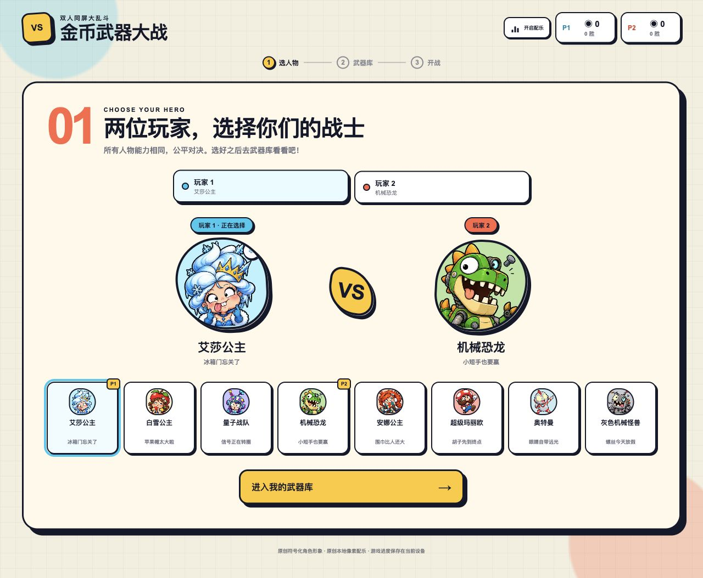
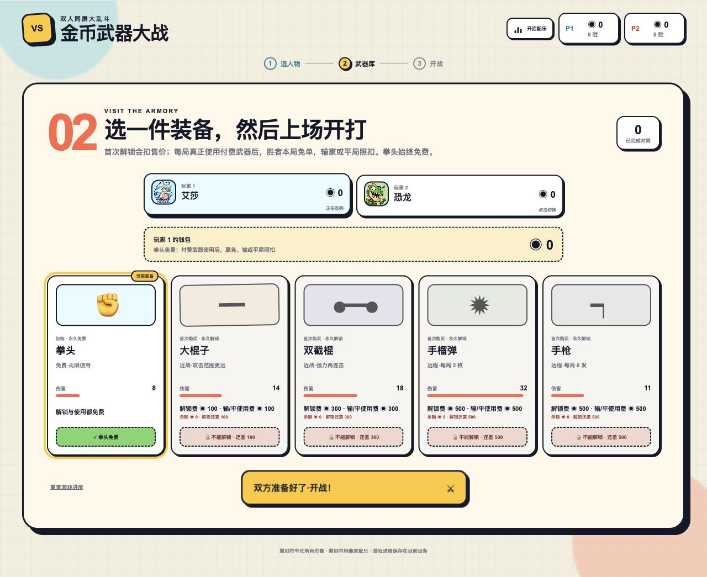
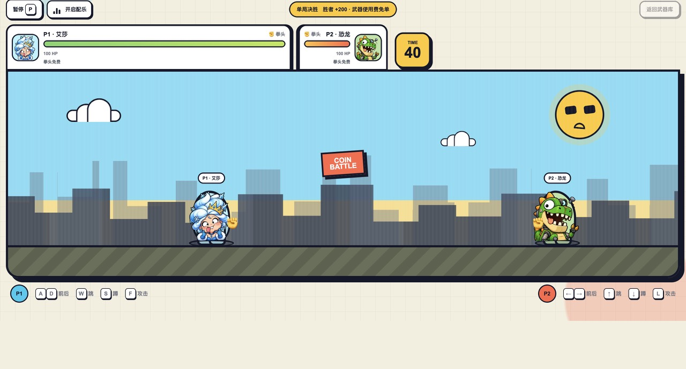
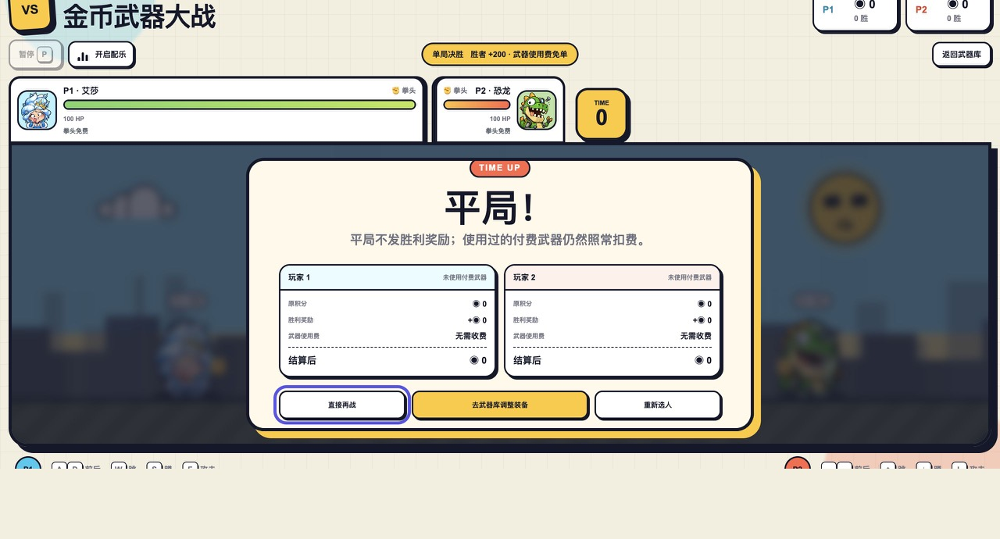

# Coin Clash Arena

在丽江旅游时，晚上在酒店无聊，小孩用Codex创作的PC游戏，简单有趣，起名**金币武器大战**。这是一款轻松搞怪的双人同屏格斗游戏。两位玩家选择角色、解锁武器，在同一块屏幕上展开单局对决；获胜可以赚取金币，并免除本局付费武器的使用费。

## 游戏截图

| 角色选择 | 武器库 |
| --- | --- |
|  |  |
| **双人实战** | **回合结算** |
|  |  |

## 游戏特色

- 8 位原创搞怪角色，能力一致，胜负只看操作。
- 拳头、大棍子、双截棍、手榴弹、手枪共 5 种武器。
- 胜者获得 200 金币，并免除本局付费武器使用费。
- 支持键盘双人操作与触屏控制，适配桌面和移动设备。
- 原创本地像素配乐，可随时开启、暂停或关闭。
- 角色、金币、武器和胜场会保存在当前设备中。

## 操作方式

| 玩家 | 移动 | 跳跃 | 下蹲 | 攻击 |
| --- | --- | --- | --- | --- |
| P1 | `A` / `D` | `W` | `S` | `F` |
| P2 | `←` / `→` | `↑` | `↓` | `L` |

对局中按 `P` 可以暂停或继续游戏。

## 快速开始

需要 Node.js `>= 22.13.0`。

```bash
npm install
npm run dev
```

启动后访问 [http://localhost:3000](http://localhost:3000)。

## 验证项目

```bash
npm run build
npm test
npm run lint
```

## 技术栈

- React 19 + TypeScript
- vinext + Vite 8
- Cloudflare Workers 本地模拟运行时
- 原生 CSS 动画与 Web Audio API

## 数据说明

游戏进度保存在浏览器的 `localStorage` 中，不需要注册账号或连接后端。点击武器库中的“重置游戏进度”可以清空两位玩家的金币、胜场和已购武器。
